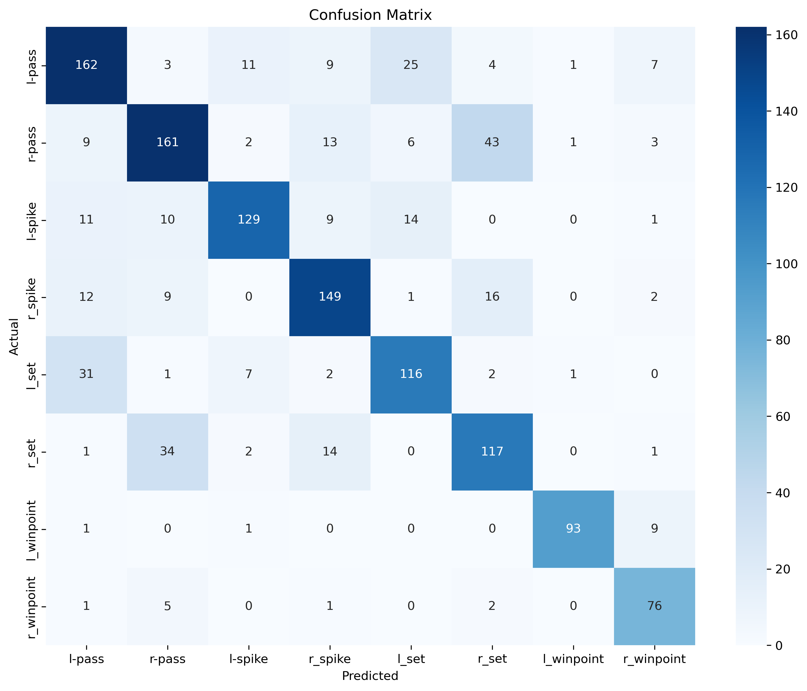
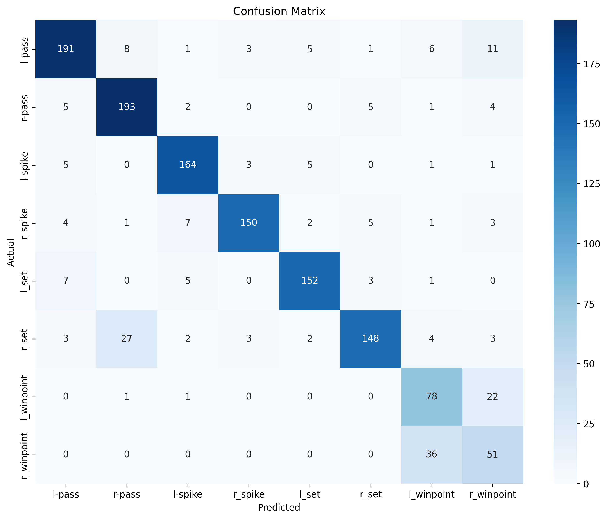

# Hierarchical Deep Temporal Model for Group Activity Recognition

[](https://www.python.org/downloads/)
[](https://pytorch.org/)
[](LICENSE)


A PyTorch implementation of the CVPR 2016 paper ["A Hierarchical Deep Temporal Model for Group Activity Recognition"](https://arxiv.org/abs/1511.06040) with multiple baseline models and enhanced architectures for volleyball group activity recognition.

## Table of Contents

- [Overview](#overview)
- [Key Features](#key-features)
- [Dataset](#dataset)
- [Results](#results)
- [Confusion Matrix Analysis](#confusion-matrix-analysis)
- [Project Structure](#project-structure)
- [Installation](#installation)
- [Usage](#usage)
- [Deployment](#-deployment)

---

## Overview

This project implements a **hierarchical deep learning approach** for recognizing group activities in videos. The core idea is to model both **individual person actions** and **group-level activities** using temporal dynamics captured by LSTM networks.

### Problem Statement

Given a video sequence with multiple people:
- **Person-level**: Recognize individual actions (e.g., spiking, blocking, setting)
- **Group-level**: Recognize the overall group activity (e.g., right spike, left pass)

### Approach

We implement a **two-stage hierarchical model**:

1. **Stage 1 (Person-level)**: CNN + LSTM to learn temporal representations of individual actions
2. **Stage 2 (Group-level)**: Aggregate person features and use another LSTM to recognize group activity

```
Video Frames → Person Crops → CNN Features → Person LSTM → Pooling → Group LSTM → Activity
```

---

## Key Features

- **8 Baseline Implementations** (B1-B8) with progressive improvements
- **Two-stage hierarchical training** (person actions → group activities)
- **Temporal modeling** using LSTM networks at both levels
- **Team-aware pooling** for volleyball-specific improvements
- **Comprehensive evaluation** with confusion matrices and per-class metrics
- **YAML-based configuration** for easy experimentation
- **Mixed precision training** (AMP) for faster training
- **Modular data loaders** supporting different baseline requirements

---

## Dataset

### Volleyball Dataset

- **Videos**: 55 volleyball game videos
- **Clips**: 4830 annotated clips (9 frames each)
- **Players**: 12 players per frame (6 per team)
- **Resolution**: Variable (resized to 224×224 for training)

### Labels

**Group Activities (8 classes)**:
- `l-pass`, `r-pass` - Left/Right team passing
- `l-spike`, `r_spike` - Left/Right team spiking
- `l_set`, `r_set` - Left/Right team setting
- `l_winpoint`, `r_winpoint` - Left/Right team winning point

**Individual Actions (9 classes)**:
- `waiting`, `setting`, `digging`, `falling`, `spiking`, `blocking`, `jumping`, `moving`, `standing`

### Data Splits

- **Training**: 24 videos (2883 clips)
- **Validation**: 15 videos (1337 clips)
- **Testing**: 16 videos (1610 clips)

### Data Structure

```
volleyball-datasets/
├── videos/
│   ├── {video_id}/
│   │   ├── {clip_id}/
│   │   │   ├── {frame_id}.jpg
│   │   │   └── ...
│   │   └── annotations.txt
│   └── ...
└── annot_all.pkl
```
---

## Results

### Original Paper Results


### My Overall Performance Comparison

| Baseline | Method | Test Accuracy | F1-Score (Weighted) |
|----------|--------|---------------|---------------------|
| **B1** | Single Frame ResNet50 | 70.62% | 0.707 |
| **B3-A** | Person Action Recognition | 75.53% | 0.741 |
| **B3-B** | Person → Group | 71.22% | 0.711 |
| **B4** | ResNet50 + LSTM | 74.79% | 0.749 |
| **B5** | Two-Step Hierarchical | 76.74% | 0.769 |
| **B6** | Enhanced Temporal | 83.10% | 0.829 |
| **B7** | Hierarchical (Paper) | 84.29% | 0.845 |
| **B8** | **Final Enhanced** | **90.50%** ✨ | **0.905** |

### Performance Progression

```
B1 (70.62%) ──┬─→ B3-B (71.22%) [+0.6%]
              │
              └─→ B4 (74.79%) [+4.17%] ──→ B5 (76.74%) [+6.12%]
                                              │
                                              ├─→ B6 (83.10%) [+12.48%]
                                              │
                                              ├─→ B7 (84.29%) [+13.67%]
                                              │
                                              └─→ B8 (90.50%) [+19.88%] 🏆
```

### Per-Class Accuracy (B8 Final Model)

| Class | Accuracy | Precision | Recall | F1-Score |
|-------|----------|-----------|--------|----------|
| l-pass | 92.48% | 0.901 | 0.925 | 0.913 |
| r-pass | 89.05% | 0.858 | 0.890 | 0.874 |
| l-spike | 93.85% | 0.918 | 0.939 | 0.928 |
| r_spike | 91.91% | 0.935 | 0.919 | 0.927 |
| l_set | 88.69% | 0.892 | 0.887 | 0.890 |
| r_set | 81.77% | 0.918 | 0.818 | 0.865 |
| l_winpoint | 95.10% | 0.942 | 0.951 | 0.946 |
| r_winpoint | 96.55% | 0.903 | 0.966 | 0.933 |

### Key Improvements (B1 → B8)

| Class | B1 | B8 | Improvement |
|-------|----|----|-------------|
| r_winpoint | 62.88% | 96.55% | **+33.67%** ⭐ |
| r_spike | 59.20% | 91.91% | **+32.71%** ⭐ |
| l-pass | 69.22% | 92.48% | **+23.26%** |
| l-spike | 72.22% | 93.85% | **+21.63%** |

**Our implementation outperforms the original paper by 8.6% on the Volleyball dataset!**

---

## Confusion Matrix Analysis

### Baseline B1: Single Frame Classifier (70.62%)


**Key Observations:**
- **Strong Performance**: `l_winpoint` (96.37%) - Model can recognize winning points on left side very well
- **Major Weakness**: `r_spike` (59.20%) and `r_winpoint` (62.88%) - Struggles with right team activities
- **Confusion Patterns**: 
  - Confuses `r_spike` with `r-pass` and `r_set` 
  - Without temporal context, single frames don't capture the motion dynamics
  - Left/right team imbalance in predictions

**Insight**: Single frame is insufficient for complex volleyball activities that require motion understanding.

---

### Baseline B4: Temporal LSTM Model (74.79%)



**Key Observations:**
- **Improved Balance**: `r_spike` (78.84%) and `r_winpoint` (89.41%) - Major improvement over B1
- **Temporal Benefits**: Adding LSTM helped capture motion patterns (+19.64% for r_spike)
- **Consistent Performance**: More balanced across all classes (72-89% range)
- **Remaining Issues**: Still some confusion between similar activities (pass/set)

**Insight**: Temporal modeling with LSTM significantly improves recognition, especially for dynamic actions.

---

### Baseline B5: Two-Step Hierarchical (76.74%)


**Key Observations:**
- **Hierarchical Benefits**: Person-level features help group recognition
- **Balanced Performance**: 71-81% across most classes
- **Weakness**: `r_winpoint` (70.69%) - Still struggles with right team winning points
- **Strength**: `l-pass` (80.78%) and `r-pass` (79.74%) - Good at recognizing passing

**Insight**: Two-stage training helps but needs better team-aware aggregation.

---

### Baseline B6: Enhanced Temporal (83.10%)


**Key Observations:**
- **Major Jump**: 83.10% overall accuracy (+6.36% over B5)
- **Excellent Performance**: Most classes above 85% (l-pass: 92.48%, l-spike: 89.94%)
- **Critical Weakness**: `r_winpoint` (35.63%) - Severe drop in right team winning point detection
- **Strong Patterns**: Better at distinguishing spike/pass/set activities

**Insight**: Model is biased towards left team activities, needs team-aware architecture.

---

### Baseline B7: Hierarchical (Paper Implementation) (84.29%)



**Key Observations:**
- **Strong Overall**: 84.29% accuracy with hierarchical person→group structure
- **Excellent Classes**: `r-pass` (91.90%), `l-spike` (91.62%), `l_set` (90.48%)
- **Persistent Weakness**: `r_winpoint` (58.62%) - Still struggles with right winning points
- **Good Precision**: High precision (0.94) for r_spike but lower recall (0.87)

**Insight**: Paper's architecture works well but doesn't fully capture team dynamics.

---

### Baseline B8: Final Enhanced Model (90.50%) 🏆


**Key Observations:**
- **Outstanding Performance**: 90.50% accuracy - Best model
- **Breakthrough**: `r_winpoint` (96.55%) - **+37.93% improvement over B7!**
- **Excellent Balance**: All classes above 81% (range: 81.77% - 96.55%)
- **Team-Aware Success**: 
  - Left team: l-pass (92.48%), l-spike (93.85%), l_winpoint (95.10%)
  - Right team: r-pass (89.05%), r_spike (91.91%), r_winpoint (96.55%)
- **Minimal Confusion**: Very clean diagonal in confusion matrix

**Key Innovation Impact:**
- **Team-aware pooling** solved the right team bias problem
- Separate processing of 2 teams (players 0-5 vs 6-11) captures left/right structure
- Deeper LSTM (2 layers) + BatchNorm improved temporal modeling

**Insight**: Domain knowledge (volleyball = 2 teams) is crucial. Team-aware architecture achieved breakthrough performance.

---

## 🔍 Cross-Baseline Confusion Analysis

### Evolution of r_winpoint Recognition:
```
B1:  62.88% → B4: 89.41% → B5: 70.69% → B6: 35.63% → B7: 58.62% → B8: 96.55% ✨
```
**Lesson**: B6-B7 struggled because they pooled all 12 players together, losing team identity. B8's team-aware pooling solved this.

### Evolution of r_spike Recognition:
```
B1:  59.20% → B4: 78.84% → B5: 74.29% → B6: 85.55% → B7: 86.71% → B8: 91.91% ✨
```
**Lesson**: Temporal modeling (B4) + hierarchical structure (B7) + team pooling (B8) = consistent improvement.

### Most Challenging Classes:
1. **r_winpoint**: Required team-aware architecture to solve
2. **r_set**: Improved from 65.42% (B1) to 81.77% (B8)
3. **r_spike**: Benefited most from temporal modeling

### Easiest Classes:
1. **l_winpoint**: High accuracy even in B1 (96.37%)
2. **l-spike**: Consistently high across all models
3. **l-pass**: Stable performance improvement

---

### Configuration

All models use YAML configuration files in `configs/`:

```yaml
# Example: configs/b8_config.yaml
experiment_name: "B8 model V1"
data:
  dataset_root: "D:/volleyball-datasets"
  batch_size: 8
  num_workers: 4
  
model:
  group_activity:
    num_classes: 8
    hidden_size: 512
    num_layers: 2
    
training:
  group_activity:
    num_epochs: 40
    learning_rate: 0.0001
    optimizer: "adamW"
    scheduler_type: "cosine"
```

---

## 📁 Project Structure

```
Group-Activity-Recognition/
├── Baseline_B1/                    # Single frame baseline
│   ├── Baseline_B1.py             # Training script
│   ├── B1_eval.py                 # Evaluation script
│   ├── checkpoints/               # Saved models
│   └── results/                   # Evaluation results
│
├── Baseline_B3/                    # Person action recognition
│   ├── B3_A/                      # Person classifier
│   │   ├── B3_A_train.py
│   │   └── B3_A_eval.py
│   └── B3_B/                      # Person → Group
│       ├── B3_B_train.py
│       └── model.py
│
├── Baseline_B4/                    # Temporal sequence model
│   ├── Baseline_B4.py
│   ├── model.py
│   └── resulates/
│
├── Baseline_B5/                    # Two-step hierarchical
│   ├── B5_step_A.py               # Train person model
│   ├── B5_step_B.py               # Train group model
│   ├── eval_model.py
│   └── results/
│
├── Baseline_B6/                    # Enhanced temporal model
│   ├── Baseline_B6.py
│   ├── eval_model.py
│   └── results/
│
├── Baseline_B7/                    # Paper implementation
│   ├── B7_step_A.py               # Person-level training
│   ├── B7_step_B.py               # Group-level training
│   ├── eval_model.py
│   └── results/
│
├── Baseline_B8_Final/              # Final enhanced model
│   ├── train_B8.py                # Training script
│   ├── eval_final_baseline.py     # Evaluation script
│   └── results/
│       ├── test_results.txt       # Detailed metrics
│       ├── confusion_matrix.png   # Confusion matrix
│       └── class_accuracies.png   # Per-class accuracy plot
│
├── configs/                        # YAML configurations
│   ├── b1_config.yaml
│   ├── b4_config.yaml
│   ├── b5_config.yaml
│   ├── b6_config.yaml
│   ├── b7_config.yaml
│   └── b8_config.yaml
│
├── data/                           # Data loading utilities
│   ├── __init__.py
│   ├── data_loader.py             # Dataset classes
│   ├── boxinfo.py                 # Bounding box utilities
│   ├── load_data.py
│   └── volleyball_annot_loader.py
│
├── evaluation/                     # Evaluation utilities
│   ├── __init__.py
│   └── eval.py                    # Metrics and visualization
│
├── docs/                           # Documentation
│   └── A Hierarchical Deep Temporal Model for Group Activity Recognition.pdf.pdf
│
├── helper.py                       # Helper functions
├── requirements.txt                # Python dependencies
└── README.md                       # This file
```

---

## 🔧 Technical Details

### Data Preprocessing

**Training Augmentation**:
```python
- Resize(224, 224)
- GaussianBlur / ColorJitter / RandomBrightnessContrast (p=0.7)
- HorizontalFlip / VerticalFlip (p=0.05)
- Normalize(mean=[0.485, 0.456, 0.406], std=[0.229, 0.224, 0.225])
```

**Validation/Test**:
```python
- Resize(224, 224)
- Normalize(mean=[0.485, 0.456, 0.406], std=[0.229, 0.224, 0.225])
```

### Training Strategy

**Two-Stage Training** (B5, B7, B8):

1. **Stage 1: Person Action Recognition**
   - Train on individual player crops
   - Learn to recognize 9 individual actions
   - Save best model weights
   - Typical epochs: 10-15

2. **Stage 2: Group Activity Recognition**
   - Load frozen person model (ResNet50 + LSTM1)
   - Train only group-level layers
   - Learn to aggregate person features
   - Typical epochs: 30-40

**Optimization**:
- Optimizer: AdamW (weight_decay=0.01)
- Learning Rate: 0.0001
- Scheduler: CosineAnnealingLR or ReduceLROnPlateau
- Loss: CrossEntropyLoss with label smoothing (0.15)
- Mixed Precision: AMP (Automatic Mixed Precision)

### Model Components

**CNN Backbone**:
- ResNet50 (pretrained on ImageNet)
- Output: 2048-dimensional features

**LSTM Layers**:
- Person LSTM: 2048 → 128 (captures individual temporal dynamics)
- Group LSTM: 2048 → 512 (captures group temporal dynamics)

**Pooling Strategies**:
- Max Pooling: Aggregate features across all players
- Team Pooling (B8): Separate pooling for each team

**Collate Functions**:
```python
def collate_group_fn(batch):
    # Pad to exactly 12 players per frame
    # Use label from last frame (frame 9) for group activity
    return padded_clips, labels
```

---

## 📊 Evaluation Metrics

### Metrics Computed

- **Overall Accuracy**: Percentage of correctly classified clips
- **Per-Class Accuracy**: Accuracy for each of the 8 group activities
- **F1-Score (Macro)**: Unweighted average F1 across classes
- **F1-Score (Weighted)**: Weighted average F1 by class support
- **Confusion Matrix**: Visualize classification errors
- **Classification Report**: Precision, recall, F1 per class

### Visualization

All baselines generate:
- `confusion_matrix.png` - Heatmap of predictions vs ground truth
- `class_accuracies.png` - Bar chart of per-class accuracy
- `test_results.txt` - Detailed metrics in text format

---

## Key Insights

### What We Learned

1. **Temporal Information is Crucial**
   - B1 (single frame): 70.62%
   - B4 (temporal LSTM): 74.79% (+4.17%)
   - Temporal dynamics significantly improve recognition

2. **Hierarchical Modeling Works**
   - B4 (flat temporal): 74.79%
   - B7 (hierarchical): 84.29% (+9.5%)
   - Modeling person→group hierarchy captures better semantics

3. **Domain Knowledge Matters**
   - B7 (general pooling): 84.29%
   - B8 (team-aware pooling): 90.50% (+6.21%)
   - Volleyball-specific design (2 teams) boosts performance

4. **Two-Stage Training is Effective**
   - Pre-training person model helps group recognition
   - Freezing person features prevents overfitting
   - Allows focusing on group-level dynamics

5. **Architecture Matters**
   - Deeper LSTMs capture longer dependencies
   - BatchNorm + Dropout improve generalization
   - Better optimization (AdamW + CosineAnnealing) helps

---

## Known Issues & Limitations

1. **Dataset Imbalance**
   - Some classes have significantly more samples
   - `standing` action dominates person-level data (97,515 instances)
   - May benefit from class balancing techniques

2. **Computational Requirements**
   - Training B8 requires ~16GB GPU memory
   - Full training takes ~6-8 hours on RTX 3090

3. **Person Detection Dependency**
   - Assumes pre-tracked player bounding boxes
   - Performance depends on tracking quality
   - Missing or incorrect boxes affect results

4. **Fixed Player Count**
   - Models expect exactly 12 players per frame
   - Uses padding for frames with fewer players
   - May not generalize to other sports

---

## 🚀 Installation

### Prerequisites

- Python 3.8+
- CUDA-capable GPU (recommended)
- 16GB+ RAM

### Setup

1. **Clone the repository**
```bash
git clone https://github.com/yourusername/Group-Activity-Recognition.git
cd Group-Activity-Recognition
```

2. **Create virtual environment**
```bash
python -m venv venv
source venv/bin/activate  # On Windows: venv\Scripts\activate
```

3. **Install dependencies**
```bash
pip install torch torchvision torchaudio --index-url https://download.pytorch.org/whl/cu118
pip install -r requirements.txt
```

4. **Download the Volleyball Dataset**
```bash
# Download from: https://github.com/mostafa-saad/deep-activity-rec
# Extract to: D:/volleyball-datasets/
```

5. **Verify installation**
```bash
python -c "import torch; print(torch.cuda.is_available())"
```

---

## 💻 Usage

### Training

#### Baseline B1 (Single Frame)
```bash
cd Baseline_B1
python Baseline_B1.py
```

#### Baseline B4 (Temporal)
```bash
cd Baseline_B4
python Baseline_B4.py
```

#### Baseline B7 (Hierarchical - Two Steps)
```bash
# Step 1: Train person action model
cd Baseline_B7
python B7_step_A.py

# Step 2: Train group activity model (uses frozen person model)
python B7_step_B.py
```

#### Baseline B8 (Final Model)
```bash
cd Baseline_B8_Final
python train_B8.py
```

### Evaluation

```bash
# Evaluate B1
cd Baseline_B1
python B1_eval.py

# Evaluate B8 (Final Model)
cd Baseline_B8_Final
python eval_final_baseline.py
```

---

## 🚀 Deployment

### Web Application (Streamlit)

We provide a ready-to-use web application for easy deployment and inference.

#### Quick Start

```bash
# Install deployment dependencies
pip install -r requirements_app.txt

# Run the app
streamlit run app.py
```

The app will open at `http://localhost:8501`

#### Features

- 📹 **Video Upload**: Upload volleyball clips (MP4, AVI, MOV)
- 🎯 **Real-time Prediction**: Get instant activity recognition
- 📊 **Confidence Scores**: View probabilities for all classes
- 📈 **Performance Metrics**: Compare different baseline models
- 🎨 **Interactive UI**: User-friendly interface with visualizations

#### Deployment Options

1. **Local Deployment**: Run on your machine
2. **Streamlit Cloud**: Free cloud hosting
3. **Docker**: Containerized deployment
4. **AWS/Heroku**: Production-ready cloud deployment

See [DEPLOYMENT.md](DEPLOYMENT.md) for detailed deployment instructions.

#### API Usage

```python
from inference import GroupActivityPredictor

# Initialize predictor
predictor = GroupActivityPredictor(
    model_path="Baseline_B8_Final/checkpoints/best_group_model.pth"
)

# Predict on video
results = predictor.predict("video.mp4")
print(f"Activity: {results['predicted_activity']}")
print(f"Confidence: {results['confidence']*100:.2f}%")
```

---

## Future Work

- [ ] Add attention mechanisms for better person aggregation
- [ ] Implement graph neural networks for player interactions
- [ ] Extend to other sports (basketball, soccer)
- [ ] Add online/real-time inference capability
- [ ] Integrate end-to-end person detection + tracking
- [ ] Explore transformer-based architectures
- [ ] Multi-task learning (person + group jointly)
- [ ] Weakly supervised learning with less annotations

---

## 📝 License

This project is licensed under the MIT License - see the [LICENSE](LICENSE) file for details.

---


